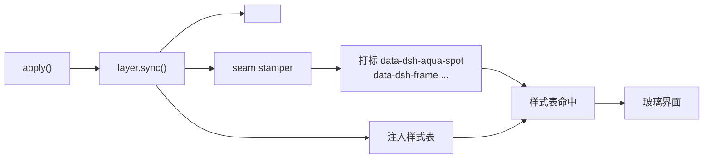

# 泡泡猫 DSH 桌面版 v2.1.0 技术文档

> **来源**：用户要求更新桌面安装包，把主题从 Seaglass 换成泡泡猫，并修复既有问题。
> **状态**：✅ v2.1.0 已编译完成，安装包 117MB，源码与二进制均已就绪。
> **关键发现**：① v2.0.0 的 payload **完全没有插件树**（装完启动即失败）；② makensis 3.08 遇到**非 ASCII 文件名**会段错误，`@oh-story/dsh` 内含一批纯中文名 `.md`，是崩溃根因。

---

## 一、工程位置

| 用途 | 路径 |
|---|---|
| 源码仓（git） | `/root/软件/dsh-desktop-pack/`（`zmm863-commits/dsh-desktop-pack`） |
| 构建工作区 | `/root/dshpack-new/`（独立目录，不污染源码仓） |
| 主题插件源码 | `/root/软件/dsh-client-ui-paopaocat/` |
| **安装包产物** | `/root/dshpack-new/dist/PaopaocatDSH-Setup-v2.1.0-x64.exe`（117MB） |
| 归档副本 | `/root/软件/dsh-desktop-pack/dist/` |

---

## 二、版本演进

| 版本 | DSH 核心 | 插件数 | 体积 | 备注 |
|---|---|---|---|---|
| v1.2.0 | 0.1.1-rc.2 | ~10 | — | 首次启动器重构 |
| v1.6.6 | 0.1.1-rc.2 | 14 | 106MB | UMUI 深色主题 |
| v1.6.8 | 0.1.1-rc.2 | 14 | 106MB | 加入便签插件 |
| v2.0.0 | 0.1.5-rc.1 | 12 | 65MB | ⚠️ **payload 漏掉插件树**，实装会启动失败 |
| **v2.1.0** | **0.1.5-rc.1** | **14** | **117MB** | 插件树补全 + 主题换代 + 显示名调整 |

> v2.0.0 的 65MB 正说明了问题：它只含 DSH 主程序（`payload/app` 211MB 压缩后），
> profile 的 `node_modules` 从未进入 payload。v2.1.0 的 117MB 才是"真正装齐插件"的体积。

---

## 三、v2.1.0 变更总览

### 3.1 修复：安装包未包含插件树（阻断级）

`payload/data-template/profiles/web/` 下**只有 `package.json`**，缺少：

- `node_modules/` —— 全部第三方插件（原应为 8694 个文件 / 163MB）
- `cordis.yml` —— profile 根入口列表
- `cordis.patch.yml` —— 用户补丁层（负责绑定监听地址、禁用插件）
- `.npmrc` —— npm 镜像与安装方式
- `pnpm-workspace.yaml` —— workspace 与 peer 策略

**后果**：新机器安装后，launcher 检测 `node_modules` 缺失 → robocopy 释放模板（但模板里没有）→ DSH 按 `dsh.profile.bundles` 解析 18 个 bundle → **一个都找不到 → 启动失败**。

**修复**：从实时 profile 完整复制插件树，并补齐 4 个配置文件。其中 `cordis.patch.yml` 绑定 **127.0.0.1**（桌面版仅本机可访问）：

```yaml
- id: webserver
  config:
    host: 127.0.0.1
    port: 3080
```

### 3.2 修复：makensis 非 ASCII 文件名段错误

**症状**：`makensis` 在输出 `Processing script file:` 之后立刻段错误（exit 139），日志为空。

**排查路径**（逐层二分，每层只测一个目录）：

```
File /r payload/data-template/*.*      → 崩
  └─ node_modules/*                    → 崩
      └─ @oh-story/dsh                 → 崩 (139)
          └─ lib                       → 崩
              └─ lib/oh-story          → 崩
                  └─ skills/story-long-write/references/genre-prose-cards
                      └─ 东方仙侠.md / 传统玄幻.md / 历史古代.md ...
```

**根因**：`genre-prose-cards/` 内是一批**纯中文文件名的 `.md`**。NSIS 3.08-3（Debian 包）在扫描非 ASCII 文件名时段错误。

> 既有认知里"makensis 中文路径段错误"此前被理解为**构建路径**含中文
> （旧 `build.sh` 会把 payload 镜像到 `/root/dshpack` 再编译）。
> 实际上 payload **内部的文件名**同样会触发，且 `/root/dshpack-new` 已是纯 ASCII 路径。

**为什么不改名**：这些文件名被 oh-story 技能按名引用（`genre-prose-cards/东方仙侠.md`），改名会破坏功能。

**修复方案**：模板改为 **zip 分发 + 首次运行解压**

| 环节 | 变更 |
|---|---|
| 打包 | `data-template/` → `data-template.zip`（56MB，Python `zipfile` 生成，UTF-8 标志位正确） |
| NSIS | `File /r "...\data-template\*.*"` → `File "...\data-template.zip"`（单个 ASCII 文件名） |
| 启动器 | robocopy → .NET `ZipFile.OpenRead` + `ZipFileExtensions.ExtractToFile` 逐条解压 |

**附带收益**：安装包体积下降（zip 已压缩，NSIS 再次整体压缩）。

### 3.3 主题换代：Seaglass → 泡泡猫玻璃主题

| 项目 | 变更 |
|---|---|
| 插件树 | 移除 `dsh-client-ui-seaglass`，加入 `dsh-client-ui-paopaocat`（**实体目录**，非软链） |
| bundles | 18 项，`dsh-client-ui-paopaocat` 在末位 |
| dependencies | `"dsh-client-ui-paopaocat": "file:./node_modules/dsh-client-ui-paopaocat"` |
| 安装界面 | 「🐱 泡泡猫玻璃主题 · 蓝白玻璃拟态 · 双风格切换」 |
| 顺带清理 | 清单里的重复项；补上 LLM Fallbacks / Session Log Export |

### 3.4 显示名调整

`dsh-agnes-studio` 的侧边栏名由「🎬 Agnes 创意站」改为「🎬 **泡泡猫的影视工具**」：

- `src/client/index.ts`：`aria-label` + `.agnes-entry-label`
- `src/index.ts`：系统提示中的插件说明（旧名保留为**别名**，模型仍可识别）
- `scripts/smoke-client.mjs`：断言同步更新
- 桌面包内副本 + 安装界面清单

---

## 四、payload 结构（v2.1.0）

```
payload/
├── app/                        # @deepseek-ai/dsh@0.1.5-rc.1 全量（211MB）
│   ├── lib/bin.js
│   └── node_modules/           # 242 个 @deepseek-ai 包 + 依赖
├── node/                       # Node.js v22.23.2 for Windows（84MB）
├── git/                        # MinGit for Windows（114MB）
├── launcher/                   # start.ps1 + first-run.ps1 + check-settings.cjs
├── data-template.zip           # ★ 首次安装解压到 %APPDATA%\PaopaocatDSH（56MB / 8694 文件）
│   ├── profiles/web/
│   │   ├── package.json        # bundles 18 项 + dependencies
│   │   ├── cordis.yml          # profile 根（空入口列表）
│   │   ├── cordis.patch.yml    # 绑定 127.0.0.1:3080
│   │   ├── .npmrc              # npmmirror + package-import-method=copy
│   │   ├── pnpm-workspace.yaml
│   │   └── node_modules/       # ★ 全部第三方插件
│   ├── settings.yaml           # 干净配置（无私有 Key）
│   └── .agent-presets/liangshen/
└── paopaocat.ico
```

---

## 五、构建流程

### 5.1 编译命令

```bash
cd /root/dshpack-new
rm -rf dist && mkdir -p dist
makensis installer/paopaocat-dsh.nsi
```

### 5.2 版本号维护

**只需改一处**：

```nsis
!define APPVERSION "2.1.0"          ; ← 改这里
```

下游自动派生：

```nsis
OutFile "${SRCDIR}/dist/PaopaocatDSH-Setup-v${APPVERSION}-x64.exe"
Name "${APPNAME} 桌面版 ${APPVERSION}"
```

> ⚠️ `VIProductVersion` 需要 **4 段式**，目前硬编码为 `2.1.0.0`，
> 升版时需一并修改（或改为从 `APPVERSION` 派生的宏）。

### 5.3 编译输出（v2.1.0 实测）

```
Install data:              339,828,478 bytes
Compressed data:           121,768,305 / 341,519,150 bytes (35.6%)
Total size:                121,885,557 bytes  →  117 MB
```

### 5.4 launcher 流程（start.ps1）

1. 检测 `%APPDATA%\PaopaocatDSH\profiles\web\node_modules`
   → 缺失则**解压 `data-template.zip`**（.NET ZipFile，逐条 `ExtractToFile`，`/` 转 `\`）
2. 检测 `.env` → 缺失则弹 WinForms 输入 API Key
3. 校验 `settings.yaml`（`check-settings.cjs`）
4. 检测 3080 端口 → 已监听则只开浏览器
5. 启动 `node lib/bin.js web`，关窗即停服务

> ⚠️ `start.ps1` 必须以 **UTF-8 with BOM** 保存，否则中文乱码。

---

## 六、泡泡猫主题插件技术说明

包名 `dsh-client-ui-paopaocat`，纯 Client 插件（Host 半边为空实现）。

### 6.1 模块结构

```
src/client/
├── index.ts                  入口：locale + 设置分区 + 品牌替换
├── ppc-layer.ts              核心层：生命周期 / CSS 变量 / 流体 / 场景 / 辉光
├── ppc-preset.ts             双风格参数（含显式调色板）
├── ppc-fluid-shader.ts       WebGL2 流体模拟
├── ppc-fluid-tones.ts        调色板调制（色相旋转 + 明度缩放）
├── ppc-seam-stamper.ts       DOM seam 打标（主题生效的关键）
├── ppc-decor-css.ts          装饰动画 + 令牌重映射 + 面板去底
├── ppc-styles.ts             移植的 Seaglass 主样式表（73KB）
├── ppc-default-wallpaper.ts  内置默认壁纸（data URL）
├── ppc-brand-assets.ts       猫爪 / 小鱼 / 泡泡 / 星光 / 猫角色 SVG
├── ppc-ambient-scene.ts      装饰场景组装
└── ppc-settings-row.tsx      设置面板 UI
```

### 6.2 双风格预设

**关键设计**：预设**显式给出调色板**，不由 depth 反算。

> 早期版本用「hueBase + depth」推算颜色，结果两版都落成相近的深蓝（`#0053a5` / `#0081c1`），
> 用户无法分辨。现改为预设直接提供 `fluidLight` / `fluidDark` 三色。

| 维度 | 淡雅 Soft | 蓝色 Blue |
|---|---|---|
| 浅色流体主色 | `#cfe4f5` 淡冰蓝 | `#4aa8e0` 天空蓝 |
| 深色流体主色 | `#5b7fa3` | `#2a95cc` |
| 磨砂度 | 32（倍率 0.85） | 36（倍率 1.05） |
| 模糊度 | 16px | 22px |
| 装饰密度 | 0.35 | 1.0 |
| 背景明度 | 68 | 46 |

用户滑块语义：**色调 = 色相旋转**，**深浅 = 明度缩放（50 = 预设原色）**。

### 6.3 主题生效链路（易踩坑）



两个致命前提：

1. **必须在 `apply()` 里调用 `layer.sync()`**。此前照抄 Seaglass 结构却漏了这一步（Seaglass 靠设置订阅间接触发），
   导致插件加载、设置页注册成功，但 `<html>` 上没有 `data-ppc`，**界面纹丝不动**。
2. **seam stamper 不可省**。DSH 的界面 DOM 没有现成钩子，样式表全部依赖 `data-*`；
   stamper 用 `MutationObserver` 把标记打到真实元素上。只写 CSS 不写 stamper = 零命中。

### 6.4 内层不透明元素：两类问题

**问题一：固定 class 的实底**

| 位置 | 元素 | 实底色 |
|---|---|---|
| 左侧边栏 | `hHd-Xa_root`（`data-dsh-sidebar-root`） | `rgb(27,27,28)` |
| 左侧边栏 | `Nqubda_panel` | `rgb(22,33,48)` |
| 右侧边栏 | `P3OORG_panel` | `rgb(21,21,23)` |

处理：两栏的 `> *` 与 `[class*='panel']` 强制 `background-color: transparent`。

**问题二：设计令牌（更根本）**

深层组件不写死颜色，而是消费 DSH 令牌，默认全是不透明深色：

```
--dsw-alias-bg-base:          #151517
--dsw-alias-bg-layer-1:       #232324
--dsw-alias-bg-layer-2:       #2c2c2e
--dsw-alias-bg-layer-3:       #353638
--dsw-specific-sidebar-fill:  #1b1b1c
```

**删 class 永远删不完**。正解是利用**自定义属性继承**：在两栏上重定义令牌，
其内部**任意深度**的组件自动变玻璃，零协调：

```css
[data-ppc][data-dsh-float] [class*='sidebarCol'],
[data-ppc][data-dsh-float] [class*='rightbarCol'] {
  --dsw-alias-bg-base: transparent;
  --dsw-specific-sidebar-fill: transparent;
  --dsw-alias-bg-layer-1: color-mix(in srgb, rgb(34 38 47) calc(50% * var(--dsh-aqua-frost, 1)), transparent);
  /* layer-2 / layer-3 / bg-overlay 同理 */
}
```

### 6.5 ⚠️ 禁止给主面板加 `backdrop-filter`

`backdrop-filter` 会为 `position: fixed` 后代**创建包含块**。
DSH 的设置面板正是挂在**侧边栏内部**的 fixed 浮层 ——
一旦给侧边栏加模糊，设置面板会被困在侧边栏里渲染（**实测踩坑**）。

模糊只加在输入框的 `::before` 上（伪元素不创建包含块），主面板靠**磨砂度**控制的不透明度体现质感。

### 6.6 右侧栏需额外适配

DSH 0.1.5 的右列 class 是 **`rightbarCol`**，而移植的 Seaglass 样式表引用的是
0.1.2 时代的 `detailsCol`（已不存在）——**共 0 处引用**，右侧栏原本完全没有主题。
已补：浮起留边 + 圆角 + 描边 + 投影 + 玻璃底，并修正 seam 选择器。

### 6.7 设置面板

主面板 4 组 + 折叠的「高级设置」：

> 总开关 → **风格**（淡雅/蓝色）→ **背景**（流体/壁纸）→ **装饰与效果**
> → `▸ 高级设置`（左侧边栏玻璃色 / 右侧边栏玻璃色 / 玻璃材质 / 字体）

两侧栏各有**取色器 + 不透明度**，自定义色直接给 `rgba()`（不透明度即 alpha），
「跟随主题」则回落到预设玻璃色。

### 6.8 内置资源

| 资源 | 来源 | 体积 |
|---|---|---|
| 默认壁纸 | **Agnes API** 生成（`agnes-image-2.1-flash`）：暗调电影感流云 + 绯红彼岸花 + 月光 | 158KB JPEG（原图 1248×832 PNG 1.6MB） |
| 猫角色 / 猫爪 / 小鱼 / 泡泡 / 星光 | 自绘内联 SVG（`currentColor`，跟随主题） | < 4KB |
| 字体 | Space Grotesk Variable（base64 woff2） | 65KB |

> 生图规范：所有图形成像必须走 Agnes API，禁止 SVG 代码生成或 ImageMagick 绘制。
> `convert` 仅用于**压缩 Agnes 产出的图**，不用于作图。

### 6.9 构建校验

```bash
cd /root/软件/dsh-client-ui-paopaocat && npm run build
```

`build` = `tsdown` → `build.mjs`（包装为 `__ModuleLoader__.load({id, factory})`）→ `smoke-client.mjs`（15 项）。

**client 半边必须是 CJS 单文件**：
- `format: 'cjs'`（ESM 会残留 `import React from "react"`，在 CJS factory 内直接语法错误）
- `noCodeSplit: true`（禁止动态 import，chunk 相对路径按页面 URL 解析 → 404）
- React 走 factory 的 `require`

---

## 七、关键坑速查

| 坑 | 症状 | 规避 |
|---|---|---|
| payload 漏插件树 | 新机装完启动失败 | 复制完整 `node_modules` + 4 个配置文件 |
| makensis 非 ASCII 文件名 | 编译期段错误、日志为空 | 模板打包为 zip，首次运行解压 |
| `layer.sync()` 未调用 | 设置页在、界面不变 | `apply()` 里显式调用 |
| 缺 seam stamper | CSS 零命中 | 用 `MutationObserver` 打 `data-*` |
| 设计令牌不透明 | 深层组件盖住玻璃 | 容器上重定义令牌（属性继承） |
| 给侧边栏加 `backdrop-filter` | 设置面板被困在侧边栏 | 只加在 `::before` 上 |
| 流场缓冲尺寸只算一次 | 切回流体温是一片纯色 | 尺寸变化时重建缓冲 |
| 重复 loader entry id | 启动崩溃 | bundle 补丁与 profile patch 不可同时 insert 同一 id |
| `dsh plugin add` | pnpm store 损坏、随机剥掉他人文件 | 手工三件套：软链 + dependencies + bundles |
| single 插槽替换 | 注册成功但渲染不变 | 必须传 `priority`（默认占位者为 0） |
| `start.ps1` 编码 | 中文乱码 | UTF-8 with BOM |

---

## 八、验证方法

### 8.1 编译期

```bash
# 组合树（不启动服务）
dsh --profile web --dump-config

# 运行中的客户端模块图（动态 Cordis Host 插件读 ctx.clientModules.graph()）
# 关键字段：targetPresent / url / rev / clientPath
```

### 8.2 浏览器实测

用**动态 Cordis Client 插件**直接读 DOM（需用户授权一次）：

- 主题：`document.documentElement` 的 `data-ppc` / `data-ppc-build`
- 玻璃：侧边栏/右栏的 `getComputedStyle().backgroundColor`
- 不透明层：遍历子树按**渲染面积排序**，找盖住玻璃的大块
- 品牌插槽：`[data-slot="sidebar.brand.mark"]` 的 `innerHTML`

### 8.3 安装包

在 Windows 上跑一遍：安装 → 首次启动（应解压模板并弹 Key 向导）→ 确认 `%APPDATA%\PaopaocatDSH\profiles\web\node_modules` 已释放、侧边栏显示泡泡猫主题。

---

## 九、待办

- [ ] 实装验证：Windows 上完整跑一遍 v2.1.0 安装流程
- [ ] `VIProductVersion` 改为从 `APPVERSION` 派生，做到版本号只改一处
- [ ] 左上角品牌替换（`sidebar.brand.mark` / `.name` → 猫头 + 「泡泡猫的智能终端」）实装验证
- [ ] 切风格是否重置五个滑块（当前会重置，可改为只换配色）
- [ ] 发布：GitHub Release + release-body.md

---

*文档版本 v2.1.0 · 对应安装包 `PaopaocatDSH-Setup-v2.1.0-x64.exe`（117MB）*
